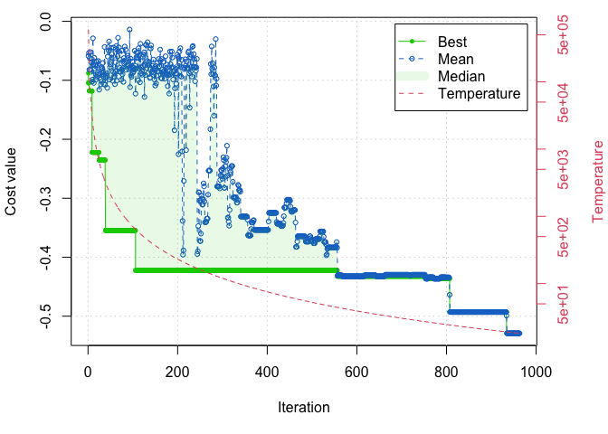

WCS FIL Project Analysis
================

## <a name="libraries"></a> **Load all libraries**

``` r
library(plyr)
library(dplyr)
library(tidyverse)
library(ggplot2)
library(readxl)
library(lubridate)
library(Hmisc)
library(writexl)
library(naniar)
library(plotrix)
```

# Quality Control

## Import dataset

The google drive version shared via WCS USAID google drive folder has
several errors with month, fishing gear type, and hidden formatting in
excel. For any future analyses, I recommend using the
`LengthData_20230809_AHcleaned` excel sheet produced from this script.

``` r
## when running future iterations of raw data file, replace the file name below 
## having troubles with file path so using the absolute path instead

data <- read_excel("/Users/austinhumphries/Library/CloudStorage/GoogleDrive-humphries@uri.edu/My Drive/R projects/USAID_WCS_climaterefugia/data/LengthData_20230809.xlsx", sheet = "Clean_data",
                                col_types = c("date", "text", "text", "text", "text", 
                                              "text", "text", "numeric", "numeric", "text",
                                              "text", "numeric", "numeric", "numeric")) %>%
  dplyr::rename(Weight_kg = `Weight(Kg)`) %>% dplyr::rename(Weight_g = `Weight( Grams`)

nrow(data) ## 957 20230712 download from google drive 
```

    ## [1] 957

### Cleaning dataset

**Month and Year**

``` r
#unique(data$Month) 
## "Sept"      "September" "Oct"       "October"   "August"    "November" 

## changing all Sept and Oct entries to read September and October 
## $ indicates end of a phrase; otherwise all 'Sept' in 'September' would also be changed 
data <- data %>%
  mutate(Month = gsub("Sept$", "September", Month),
         Month = gsub("Oct$", "October", Month))

unique(data$Month) 
```

    ## [1] "September" "October"   "August"    "November"

``` r
## end result 
# "September" "October"   "August"    "November" 

unique(data$Year) ## all 2022 
```

    ## [1] "2022"

**Landing site**

``` r
unique(data$`Landing Site`)
```

    ## [1] "Vanga"    "Shimoni"  "Mkwiro"   "Kibuyuni" "Wasini"

**Date Collector**

``` r
unique(data$`Data Collector`)
```

    ## [1] "Sofia Saidi"     "Roselyne Mwakio" "Roselyn Mwakio"

**Group**

``` r
unique(data$Group)
```

    ## [1] "1" "4" "2" "3" "5" "6" "7" "8"

**Fishing Gear**

``` r
data <- data %>%
  mutate(Fishgear = gsub("SG/HS", "HS/SG", Fishgear),
         Fishgear = gsub("ringnet", "Ring net", Fishgear),
         Fishgear = gsub("reefseine", "Reef seine", Fishgear),
         Fishgear = gsub("Reefseine", "Reef seine", Fishgear),
         Fishgear = gsub("Ringnet", "Ring net", Fishgear),
         Fishgear = gsub("Reef net", "Reef Net", Fishgear),
         Fishgear = gsub("speargun", "Speargun", Fishgear),
         Fishgear = gsub("reefsen", "Reef seine", Fishgear),
         Fishgear = gsub("Handline", "Hand line", Fishgear),
         Fishgear = gsub("monofilament", "Monofilament", Fishgear),
         Fishgear = gsub("Monofilament", "Hand line", Fishgear))

unique(data$Fishgear)
```

    ##  [1] "Reef seine"        "Speargun"          "HS/SG"            
    ##  [4] "Malema"            "Basket trap"       "Ring net"         
    ##  [7] "Traps"             "Hand line"         "Gillnet"          
    ## [10] "Reef Net"          "Traps & handlines"

**\# Boats and Fishers**

``` r
range(data$`# Boats`) ##0-2
```

    ## [1] 0 2

``` r
hist(data$`#Fishers`) ##1-35
```

<!-- -->

``` r
hist(data$Length) ## 7.6 - 61.5 
```

<!-- -->

``` r
hist(data$Weight_kg) ## 0 - 1.113
```

<!-- -->

``` r
data <- data %>%
  ## changing all NA's to zero in Weight_g column 
  mutate(Weight_g = coalesce(Weight_g, 0)) 

hist(data$Weight_g) ## 0 - 1113 
```

<!-- -->

**Fish ID**

``` r
## unique() outputs the name of each unique character in Family
unique(data$Family)
```

    ##  [1] "Acanthuridae"    "Apogonidae"      "Aulostomidae"    "Belonidae"      
    ##  [5] "Caesionidae"     "Carangidae"      "Chaetodontidae"  "Dasyatidae"     
    ##  [9] "Dorosomatidae"   "Engraulidae"     "Ephippidae"      "Epinephelidae"  
    ## [13] "Gerreidae"       "Haemulidae"      "Hemiramphidae"   "Holocentridae"  
    ## [17] "Labridae"        "Lethrinidae"     "Lutjanidae"      "Monodactylidae" 
    ## [21] "Mullidae"        "Nemipteridae"    "Platycephalidae" "Pomacentridae"  
    ## [25] "Priacanthidae"   "Scaridae"        "Scombridae"      "Serranidae"     
    ## [29] "Siganidae"       "Sillaginidae"    "Sphyraenidae"    "Synodontidae"   
    ## [33] "Terapontidae"

``` r
## sort() outputs Species in alphabetical order
sort(unique(data$Species))
```

    ##   [1] "Abudefduf vaigiensis"        "Acanthurus dussumieri"      
    ##   [3] "Acanthurus nigricauda"       "Alepes djedaba"             
    ##   [5] "Anampses caeruleopunctatus"  "Atule mate"                 
    ##   [7] "Aulostomus chinensis"        "Calotomus carolinus"        
    ##   [9] "Carangoides ciliarius"       "Carangoides gymnosthethus"  
    ##  [11] "Carangoides malabaricus"     "Cephalopholis boenak"       
    ##  [13] "Cephalopholis spiloparaea"   "Chaetodon auriga"           
    ##  [15] "Cheilinus trilobatus"        "Cheilio inermis"            
    ##  [17] "Cheilodipterus arabicus"     "Ctenochaetus striatus"      
    ##  [19] "Decapterus kurroides"        "Encrasicholina heteroloba"  
    ##  [21] "Epinephelus merra"           "Epinephelus rivulatus"      
    ##  [23] "Epinephelus spilotoceps"     "Epinephelus tauvina"        
    ##  [25] "Euthynnus affinis"           "Gerres longirostris"        
    ##  [27] "Gerres oblongus"             "Gerres oyena"               
    ##  [29] "Gomphosus caeruleus"         "Halichoeres hortulanus"     
    ##  [31] "Hemiramphus far"             "Hemiramphus marginatus"     
    ##  [33] "Hyporhamphus affinis"        "Hyporhamphus dussumieri"    
    ##  [35] "Leptoscarus vaigiensis"      "Lethrinus borbonicus"       
    ##  [37] "Lethrinus harak"             "Lethrinus lentjan"          
    ##  [39] "Lethrinus mahsena"           "Lethrinus microdon"         
    ##  [41] "Lethrinus nebulosus"         "Lethrinus obsoletus"        
    ##  [43] "Lethrinus olivaceus"         "Lethrinus rubrioperculatus" 
    ##  [45] "Lethrinus variegatus"        "Lutjanus argentimaculatus"  
    ##  [47] "Lutjanus fulviflamma"        "Lutjanus kasmira"           
    ##  [49] "Lutjanus lutjanus"           "Monodactylus argenteus"     
    ##  [51] "Monotaxis grandoculis"       "Mulloidichthys vanicolensis"
    ##  [53] "Myripristis berndti"         "Naso annulatus"             
    ##  [55] "Naso hexacanthus"            "Papilloculiceps longiceps"  
    ##  [57] "Parupeneus barberinus"       "Parupeneus cyclostomus"     
    ##  [59] "Parupeneus heptacanthus"     "Parupeneus indicus"         
    ##  [61] "Parupeneus macronemus"       "Platax teira"               
    ##  [63] "Plectorhinchus centurio"     "Plectorhinchus chubbi"      
    ##  [65] "Plectorhinchus gaterinus"    "Plectorhinchus schotaf"     
    ##  [67] "Plectorhinchus sordidus"     "Plectorhinchus vittatus"    
    ##  [69] "Priacanthus hamrur"          "Pterocaesio chrysozona"     
    ##  [71] "Rastrelliger kanagurta"      "Sardinella albella"         
    ##  [73] "Sardinella longiceps"        "Sardinella neglecta"        
    ##  [75] "Sargocentron caudimaculatum" "Sargocentron praslin"       
    ##  [77] "Saurida gracilis"            "Scarus ghobban"             
    ##  [79] "Scarus globiceps"            "Scarus psittacus"           
    ##  [81] "Scarus rubroviolaceus"       "Scolopsis bimaculata"       
    ##  [83] "Scolopsis ghanam"            "Scomberoides tol"           
    ##  [85] "Scomberomorus commerson"     "Siganus argenteus"          
    ##  [87] "Siganus canaliculatus"       "Siganus stellatus"          
    ##  [89] "Siganus sutor"               "Sillago sihama"             
    ##  [91] "Sphyraena barracuda"         "Sphyraena flavicauda"       
    ##  [93] "Sphyraena obtusata"          "Strongylura leiura"         
    ##  [95] "Taeniamia mozambiquensis"    "Taeniura lymma"             
    ##  [97] "Terapon jarbua"              "Tylosurus crocodilus"       
    ##  [99] "Upeneus margarethae"         "Upeneus saiab"              
    ## [101] "Upeneus sulphureus"          "Upeneus vittatus"

This dataset was pretty clean

Exporting clean set

``` r
data %>% write_xlsx("/Users/austinhumphries/Library/CloudStorage/GoogleDrive-humphries@uri.edu/My Drive/R projects/USAID_WCS_climaterefugia/data/LengthData_20230809_AHcleaned.xlsx")
```

# Length based summary

Importing Galligan dataset from other project

``` r
galligan <- read.csv('/Users/austinhumphries/Library/CloudStorage/GoogleDrive-humphries@uri.edu/My Drive/R projects/USAID_WCS_climaterefugia/data/SpeciesData_GatedTraps_Galligan_expanded.csv', header=TRUE, sep = ",") %>%
  dplyr::select(-Family)
## 260 species included in the above sheet 

data2 <- left_join(data, galligan, by = c("Species"))  
nrow(data2) ## should be 957- this should be match the original number b/c haven't removed any data 
```

    ## [1] 957

Checking for species not found in Galligan extended that were found in
the larger dataset:

``` r
data2 %>% filter(is.na(Lmat_cm)) %>% dplyr::select(Species) %>% distinct()
```

    ## # A tibble: 0 × 1
    ## # ℹ 1 variable: Species <chr>

``` r
## output should be zero 
```

## 1. Calculating L:Lopt and L:Lmat Ratios for each fish caught and getting mean and std error for each

``` r
data2 <- data2 %>%
  mutate(Lopt_ratio = Length/Lopt_cm,
         Lmat_ratio = Length/Lmat_cm)

## checking range and hist of each ratio 
hist(data2$Lopt_ratio) ## range = 0.2074522 3.5000000
```

<!-- -->

``` r
hist(data2$Lmat_ratio) ## range = 0.2672897 3.1111111
```

<!-- -->

``` r
## summary table

data3 <- ddply(data2, .(Species), summarise, 
               Lopt_mean = mean(Lopt_ratio, na.rm=TRUE), 
               Lopt_se = std.error(Lopt_ratio, na.rm=TRUE),
               Lmat_mean = mean(Lmat_ratio, na.rm=TRUE),
               Lmat_se = std.error(Lmat_ratio, na.rm=TRUE))
data3
```

    ##                         Species Lopt_mean     Lopt_se Lmat_mean     Lmat_se
    ## 1          Abudefduf vaigiensis 1.6570681          NA 1.9338606          NA
    ## 2         Acanthurus dussumieri 1.3850223 0.071350623 1.4489560 0.074644224
    ## 3         Acanthurus nigricauda 1.6692659          NA 1.7102158          NA
    ## 4                Alepes djedaba 0.7085406 0.030555149 0.7456370 0.032154895
    ## 5    Anampses caeruleopunctatus 1.1749351          NA 1.3649412          NA
    ## 6                    Atule mate 1.0572451 0.031178273 1.1162791 0.032919192
    ## 7          Aulostomus chinensis 0.8714556          NA 1.0477273          NA
    ## 8           Calotomus carolinus 1.0079643 0.105309704 1.3453072 0.140554480
    ## 9         Carangoides ciliarius 0.5083333 0.007406829 0.5876686 0.008562808
    ## 10    Carangoides gymnosthethus 0.4811558 0.058175561 0.5886270 0.071169693
    ## 11      Carangoides malabaricus 0.8977965 0.022036995 0.9671717 0.023739853
    ## 12         Cephalopholis boenak 1.0049665 0.096191322 1.0974142 0.105040036
    ## 13    Cephalopholis spiloparaea 1.7233258          NA 1.8446140          NA
    ## 14             Chaetodon auriga 1.9917035          NA 2.1896685          NA
    ## 15         Cheilinus trilobatus 1.1827760 0.155604429 1.3890709 0.182744307
    ## 16              Cheilio inermis 1.6047895 0.110518299 1.8643099 0.128390896
    ## 17      Cheilodipterus arabicus 1.2397661 0.022836987 1.1977401 0.022062852
    ## 18        Ctenochaetus striatus 1.6231150          NA 1.6189985          NA
    ## 19         Decapterus kurroides 1.2492877 0.038408743 1.3789308 0.042394556
    ## 20    Encrasicholina heteroloba 1.6852300 0.202610058 1.4840085 0.178417813
    ## 21            Epinephelus merra 1.1607303          NA 1.3232857          NA
    ## 22        Epinephelus rivulatus 0.9037559 0.129107981 0.9577114 0.136815920
    ## 23      Epinephelus spilotoceps 1.2258065          NA 1.3718412          NA
    ## 24          Epinephelus tauvina 0.4560811 0.152027027 0.5567010 0.185567010
    ## 25            Euthynnus affinis 0.5238880 0.022648644 0.6751592 0.029188380
    ## 26          Gerres longirostris 0.9657466 0.026359096 1.0127289 0.027641431
    ## 27              Gerres oblongus 0.8828751 0.021808870 0.9258258 0.022869842
    ## 28                 Gerres oyena 1.5599296 0.166609984 1.8478892 0.197365821
    ## 29          Gomphosus caeruleus 0.7971014          NA 0.8418367          NA
    ## 30       Halichoeres hortulanus 1.0057143 0.320000000 1.0352941 0.329411765
    ## 31              Hemiramphus far 1.0201934 0.047824874 1.1279874 0.052878069
    ## 32       Hemiramphus marginatus 1.7245509 0.026101191 1.7668712 0.026741711
    ## 33         Hyporhamphus affinis 1.2716812 0.106299747 1.3776547 0.115158059
    ## 34      Hyporhamphus dussumieri 1.1376518 0.037617705 1.2324561 0.040752514
    ## 35       Leptoscarus vaigiensis 0.8944191 0.021868822 1.1730697 0.028681915
    ## 36         Lethrinus borbonicus 0.9945111 0.076868550 1.1378310 0.087946148
    ## 37              Lethrinus harak 0.7808370 0.027763164 0.8994627 0.031980977
    ## 38            Lethrinus lentjan 0.6574539 0.012083026 0.7828409 0.014387452
    ## 39            Lethrinus mahsena 0.5801274 0.047762075 0.7332055 0.060365044
    ## 40           Lethrinus microdon 0.7398158 0.061408256 0.8765525 0.072758060
    ## 41          Lethrinus nebulosus 0.6152200          NA 1.0000000          NA
    ## 42          Lethrinus obsoletus 0.6770403 0.019149298 0.8037444 0.022732975
    ## 43          Lethrinus olivaceus 0.4720811 0.056094872 0.5862505 0.069661015
    ## 44   Lethrinus rubrioperculatus 0.7665132 0.017579165 0.9132157 0.020943629
    ## 45         Lethrinus variegatus 0.8177740 0.047512009 0.9353833 0.054345015
    ## 46    Lutjanus argentimaculatus 0.2711763 0.004504725 0.3957509 0.006574131
    ## 47         Lutjanus fulviflamma 0.7169167 0.016160738 0.9516287 0.021451617
    ## 48             Lutjanus kasmira 0.6323886 0.021849756 0.8480381 0.029300694
    ## 49            Lutjanus lutjanus 0.9433643 0.018016822 0.9721254 0.018566115
    ## 50       Monodactylus argenteus 0.7197065 0.009913312 0.8442246 0.011628438
    ## 51        Monotaxis grandoculis 0.6944886 0.010666069 0.8215004 0.012616737
    ## 52  Mulloidichthys vanicolensis 1.3812356 0.139751569 1.5823439 0.160099435
    ## 53          Myripristis berndti 1.3470968 0.182388470 1.2640414 0.171143283
    ## 54               Naso annulatus 1.0571919          NA 1.1789275          NA
    ## 55             Naso hexacanthus 0.9283466          NA 1.0450988          NA
    ## 56    Papilloculiceps longiceps 1.6703557          NA 1.8749156          NA
    ## 57        Parupeneus barberinus 1.2780798 0.080545851 1.5195265 0.095762061
    ## 58       Parupeneus cyclostomus 1.8785430 0.099403152 2.1903728 0.115903632
    ## 59      Parupeneus heptacanthus 0.9791391 0.031887141 1.1655528 0.037957985
    ## 60           Parupeneus indicus 1.2097817 0.064612049 1.4106001 0.075337361
    ## 61        Parupeneus macronemus 1.1596288 0.026705622 1.3336942 0.030714254
    ## 62                 Platax teira 0.6583189 0.091348171 0.7839120 0.108775445
    ## 63      Plectorhinchus centurio 0.2150376          NA 0.2672897          NA
    ## 64        Plectorhinchus chubbi 0.8271300 0.014019152 0.9308302 0.015776783
    ## 65     Plectorhinchus gaterinus 0.4990818 0.008411491 0.5616535 0.009466070
    ## 66       Plectorhinchus schotaf 0.5607661 0.017131687 0.6310713 0.019279547
    ## 67      Plectorhinchus sordidus 0.9246080 0.069036139 1.0076562 0.075236953
    ## 68      Plectorhinchus vittatus 0.3633966 0.005265464 0.4306250 0.006239575
    ## 69           Priacanthus hamrur 1.1676082 0.082734970 1.2952349 0.091778402
    ## 70       Pterocaesio chrysozona 1.7549751 0.085304789 1.7419753 0.084672901
    ## 71       Rastrelliger kanagurta 1.5046663 0.048183365 1.2292873 0.039365007
    ## 72           Sardinella albella 1.3777778 0.022680461 1.4761905 0.024300493
    ## 73         Sardinella longiceps 1.2544529 0.011091346 1.2739018 0.011263305
    ## 74          Sardinella neglecta 1.9390244 0.206708416 1.8068182 0.192614661
    ## 75  Sargocentron caudimaculatum 1.3043478          NA 1.3375796          NA
    ## 76         Sargocentron praslin 0.7004831          NA 0.7397959          NA
    ## 77             Saurida gracilis 0.8454106          NA 0.8928571          NA
    ## 78               Scarus ghobban 1.1058331 0.071000720 1.5257279 0.097960337
    ## 79             Scarus globiceps 0.9896431 0.185131612 1.3835199 0.258813776
    ## 80             Scarus psittacus 1.1389709 0.068710517 1.5933918 0.096124296
    ## 81        Scarus rubroviolaceus 1.0518675          NA 1.4689458          NA
    ## 82         Scolopsis bimaculata 1.2216673 0.076849100 1.4058102 0.088432622
    ## 83             Scolopsis ghanam 1.1622807 0.065502690 1.3374722 0.075375960
    ## 84             Scomberoides tol 1.0276855 0.060102393 1.1897436 0.069580078
    ## 85      Scomberomorus commerson 0.4602224 0.043627032 0.6263097 0.059371362
    ## 86            Siganus argenteus 1.2244023          NA 1.2860339          NA
    ## 87        Siganus canaliculatus 1.4108082 0.176957080 1.3356706 0.167532604
    ## 88            Siganus stellatus 1.7364576          NA 1.7864295          NA
    ## 89                Siganus sutor 0.9623253 0.020365383 1.0028929 0.021223902
    ## 90               Sillago sihama 1.3614458 0.090361446 1.4487179 0.096153846
    ## 91          Sphyraena barracuda 0.2361827 0.006093981 0.3098143 0.007993822
    ## 92         Sphyraena flavicauda 1.1041667 0.125006782 1.1977401 0.135600577
    ## 93           Sphyraena obtusata 0.9845013 0.010171259 1.0488155 0.010835714
    ## 94           Strongylura leiura 0.8892231 0.020068914 1.1052960 0.024945472
    ## 95     Taeniamia mozambiquensis 2.2678571 0.411941748 2.0158730 0.366170442
    ## 96               Taeniura lymma 0.7328027 0.133646424 0.9414031 0.171690343
    ## 97               Terapon jarbua 0.9099099 0.038486503 0.9711538 0.041076941
    ## 98         Tylosurus crocodilus 0.7169168 0.122100955 0.9013722 0.153516295
    ## 99          Upeneus margarethae 3.3188406          NA 3.0131579          NA
    ## 100               Upeneus saiab 2.5781250 0.237736313 2.3239437 0.214297522
    ## 101          Upeneus sulphureus 1.8201658          NA 1.9902409          NA
    ## 102            Upeneus vittatus 1.4631783 0.047787346 1.4408397 0.047057768

Exporting dataset

``` r
data3 %>% write_xlsx("/Users/austinhumphries/Library/CloudStorage/GoogleDrive-humphries@uri.edu/My Drive/R projects/USAID_WCS_climaterefugia/data/LengthData_20230809_LmatLopt.xlsx")
```

## 2. Calculating Spawning Potential Ratio

### 2.1 Prepare dataframes

To use the package in step 2.2, we need each species to have a single
dataframe with only length values

``` r
#unique(data2$Species) ## 102 species ; 26 with > 10 observations 

sample_size <- data2 %>% 
  ## creating a dataframe for only length values 
  dplyr::select(Species, Length) %>% group_by(Species) %>%
  
  ## for those species with above a catch count of 3 
  mutate(sample_size = n()) %>% ungroup() 
  
sample_size %>% filter(!sample_size < 10) %>% dplyr::select(-sample_size) %>%
  ## for each Species, this function will export a csv
  group_by(Species) %>%
  group_walk(~ write_csv(.x, file = paste0("/Users/austinhumphries/Library/CloudStorage/GoogleDrive-humphries@uri.edu/My Drive/R projects/USAID_WCS_climaterefugia/data/species/", .y$Species, ".csv")))
```


More info here: <https://edis.ifas.ufl.edu/publication/FA241>.

R package to do this:
<https://sfg-ucsb.github.io/fishery-manageR/wrapping-up.html> and
<https://cran.r-project.org/web/packages/LBSPR/vignettes/LBSPR.html>.

### 2.1 Install package

``` r
## install.packages("LBSPR")
library(LBSPR)
```

### 2.2 Fitting Empirical Length Data

Length data is located in `data/species/` with 26 separate csv files.
The goal is to calculate SPR for each species using this empirical data.

``` r
# ## create new empty objects
# MyLengths <- new("LB_lengths")
# MyPars <- new("LB_pars")
# 
# ## list all potential parameters
# slotNames(MyLengths)
# slotNames(MyPars)
# 
# ## Fill MyPars 
# MyPars@Species <- "Acanthurus dussumieri"
# MyPars@Linf <- 30.04598 
# MyPars@L50 <- 15 
# MyPars@L95 <- 40
# MyPars@MK <- 1.5 
# MyPars@L_units <- "cm"
# 
# # loading folder of csv files 
# datdir <- "data/species/"
# list.files(datdir, pattern=".csv")
# 
# ## new length file
# Len1 <- new("LB_lengths", LB_pars=MyPars, 
#             file="data/species/Acanthurus dussumieri.csv", dataType="raw", header=TRUE)
# 
# 
# Shiny("LBSPR")
# Shiny("YPRSim")
```

# MSY

Estimate MSY using catch estimates based on the 5 landing sites.

1.  Evaluate this for 4 categories or levels: a.) the most abundant
    species, b.) the most abundant families, c.) fishable, d.) target
    catch.  
2.  

### 3.1 Calculate the most abundant species and families and create list.

``` r
abundant_species <- sample_size %>% dplyr::select(-Length) %>% distinct() %>%
  ## sort dataframe by the most to least abundant
  arrange(., desc(sample_size)) %>%
  ## selecting the top 10 rows (top 10 most abundant) 
  slice(., 1:10)

abundant_families <- data2 %>% 
  ## creating a dataframe for only length values 
  dplyr::select(Family, Length) %>% group_by(Family) %>%
  ## for those species with above a catch count of 3 
  mutate(sample_size = n()) %>% dplyr::select(-Length) %>% 
  distinct() %>% ungroup() %>%
  ## sort dataframe by the most to least abundant
  arrange(., desc(sample_size)) %>%
  ## selecting the top 10 rows (top 10 most abundant) 
  slice(1:10)
```

### 3.2 Downlaod TropFishR package

Resources:  
- <https://sfg-ucsb.github.io/fishery-manageR/wrapping-up.html>  
- <https://github.com/tokami/TropFishR>  
- <http://cran.nexr.com/web/packages/TropFishR/vignettes/tutorial.html>

#### 3.2.1 Installing and loading example data

``` r
# install.packages("remotes")
# remotes::install_github("tokami/TropFishR")
# install.packages(c('TropFishR','DLMTool', 'LBSPR', 'fishmethods'))

library(remotes)
library(Matrix) ##dependency of TropFishR 
```

    ## 
    ## Attaching package: 'Matrix'

    ## The following objects are masked from 'package:tidyr':
    ## 
    ##     expand, pack, unpack

``` r
library(TropFishR)
```

    ## 
    ## Attaching package: 'TropFishR'

    ## The following object is masked from 'package:dplyr':
    ## 
    ##     select

``` r
## use dplyr:: in front of select b/c TropFishR masks the 'select' fxn 

## load example data 
data("synLFQ7")
```

### 3.3 Biological stock characteristics

Data frame starts as 4 columns. Stuck on how to reproduce this with our
data.

``` r
head(synLFQ7)
```

    ## $sample.no
    ##  [1]  1  2  3  4  5  6  7  8  9 10 11 12 13 14 15 16 17 18 19 20 21 22 23 24 25
    ## [26] 26 27 28 29 30 31 32 33 34 35 36 37 38 39 40 41 42 43 44 45 46 47 48 49 50
    ## [51] 51 52 53 54 55 56 57 58 59 60 61 62 63 64
    ## 
    ## $midLengths
    ##  [1]   8  10  12  14  16  18  20  22  24  26  28  30  32  34  36  38  40  42  44
    ## [20]  46  48  50  52  54  56  58  60  62  64  66  68  70  72  74  76  78  80  82
    ## [39]  84  86  88  90  92  94  96  98 100 102 104 106 108 110 112 114 116 118 120
    ## [58] 122 124 126 128 130 132 134
    ## 
    ## $dates
    ## [1] "2016-01-01" "2016-03-02" "2016-04-02" "2016-07-02" "2016-08-01"
    ## [6] "2016-10-01" "2016-11-01" "2016-12-01"
    ## 
    ## $catch
    ##        16 16.1666666666667 16.25 16.5 16.5833333333333 16.75 16.8333333333333
    ##  [1,]   0                0     0    0                0     0                0
    ##  [2,]   0                0     0    0                0     0                0
    ##  [3,]   0                0     0    0                0     1                0
    ##  [4,]   0                0     0    0                0     0                0
    ##  [5,]   0                0     0    0                0     0                0
    ##  [6,]   0                0     0    0                0     0                0
    ##  [7,]   0                2     1    0                0     0                0
    ##  [8,]   0                4     2    3                1     0                0
    ##  [9,]   0                2     3    2                3     0                0
    ## [10,]   0                1     3   11               13     6                0
    ## [11,]   1                2     1   14               21    15               12
    ## [12,]  25                1     0   22               31    47               49
    ## [13,]  57               15     6   14               27    59               99
    ## [14,] 155               59    37   12               18    56              119
    ## [15,] 215              179   122   33               13    45              107
    ## [16,] 215              251   219   86               74    36               68
    ## [17,] 144              290   286  193              145    78               67
    ## [18,]  77              199   252  274              217   122               82
    ## [19,] 100              133   172  262              249   187              145
    ## [20,] 115               94   138  197              229   200              208
    ## [21,] 160               85   106  138              173   175              225
    ## [22,] 179              168   136  102              134   186              187
    ## [23,] 189              149   131  102              107   146              148
    ## [24,] 147              147   155  118              120   108              127
    ## [25,] 125              155   165  152              125   104              100
    ## [26,]  91              145   118  127              135   116              126
    ## [27,] 112              120   146  134              145   105              109
    ## [28,] 105              108    99  110              134   102              107
    ## [29,] 116               97   119  104              108    86               93
    ## [30,] 129              123   106  101              117   104               90
    ## [31,] 113              100    91  105               89    84               96
    ## [32,] 117               83    92   80               92    95               81
    ## [33,]  74               88    79   85              101    73               90
    ## [34,]  88               73    86   85               93    77               72
    ## [35,]  73               87    70   89               70    78               64
    ## [36,]  93               78    69   62               67    74               68
    ## [37,]  70               67    57   84               68    55               65
    ## [38,]  62               67    55   73               59    56               63
    ## [39,]  56               54    59   58               73    44               52
    ## [40,]  53               44    48   65               48    52               50
    ## [41,]  53               45    46   52               63    60               48
    ## [42,]  35               49    60   49               47    40               51
    ## [43,]  30               50    49   39               51    33               45
    ## [44,]  35               37    31   37               43    44               31
    ## [45,]  33               25    36   39               31    38               31
    ## [46,]  20               33    41   36               40    27               22
    ## [47,]  27               16    32   28               25    25               28
    ## [48,]  22               16    21   25               29    28               19
    ## [49,]  12               22    25   23               27    13               23
    ## [50,]  14               15    18   19               27    20               21
    ## [51,]  14               18    20   12               15    20               11
    ## [52,]  10                9     8   11               17     9                9
    ## [53,]  13               15     8   14               14    12               12
    ## [54,]   5                6     5   11                8     6               11
    ## [55,]   6                6     9   11                6     7                5
    ## [56,]   4                7     7    2                3     4                4
    ## [57,]   5                4     4    3                8     3                4
    ## [58,]   0                2     2    2                2     1                1
    ## [59,]   1                1     0    2                0     0                1
    ## [60,]   0                1     0    1                1     1                0
    ## [61,]   0                1     0    0                0     0                0
    ## [62,]   0                0     1    0                1     0                0
    ## [63,]   0                1     0    0                0     0                0
    ## [64,]   0                0     0    0                0     0                1
    ##       16.9166666666667
    ##  [1,]                0
    ##  [2,]                0
    ##  [3,]                0
    ##  [4,]                0
    ##  [5,]                0
    ##  [6,]                1
    ##  [7,]                0
    ##  [8,]                0
    ##  [9,]                0
    ## [10,]                2
    ## [11,]                8
    ## [12,]               29
    ## [13,]               82
    ## [14,]              149
    ## [15,]              167
    ## [16,]              130
    ## [17,]               79
    ## [18,]               80
    ## [19,]              115
    ## [20,]              131
    ## [21,]              172
    ## [22,]              181
    ## [23,]              171
    ## [24,]              133
    ## [25,]              106
    ## [26,]              103
    ## [27,]              125
    ## [28,]              105
    ## [29,]              110
    ## [30,]              106
    ## [31,]               92
    ## [32,]               74
    ## [33,]               91
    ## [34,]               77
    ## [35,]               76
    ## [36,]               80
    ## [37,]               73
    ## [38,]               71
    ## [39,]               52
    ## [40,]               54
    ## [41,]               46
    ## [42,]               40
    ## [43,]               35
    ## [44,]               35
    ## [45,]               28
    ## [46,]               31
    ## [47,]               24
    ## [48,]               24
    ## [49,]               26
    ## [50,]               17
    ## [51,]               17
    ## [52,]               13
    ## [53,]                6
    ## [54,]                7
    ## [55,]                6
    ## [56,]                6
    ## [57,]                2
    ## [58,]                2
    ## [59,]                2
    ## [60,]                2
    ## [61,]                1
    ## [62,]                0
    ## [63,]                0
    ## [64,]                0

``` r
## $sample.no -- list 1-64 
## $midLengths -- list of lengths every 2 cm 
## $dates -- list of dates
## $catch -- dataframe 

synLFQ7_catch <- as.data.frame(synLFQ7$catch)
## what do the columns mean? 
## each column would be a survey? 
```

#### 3.3.1 Growth Parameters

Commonly used growth parameters are the asymptotic length (Linf), the
growth coefficient (K) and the theoretical length at age zero (t0) of
the von Bertalanffy growth function (VBGF). The ELEFAN (ELectronic
LEngth Frequency ANalysis) methods allow to estimate Linf and K from LFQ
data by restructuring the data and fitting growth curves through the
restructured LFQ data (Pauly 1980).

**Visualize data first**

- `lfqModify` allows to change the bin size by setting the argument
  “bin_size” to a numeric
- `lfqRestructure` is used for the restructuring process  
- `MA` allows to control the number of bins used for the moving
  average  
- `addl.sqrt` allows to apply an additional squareroot transformation in
  the restructuring process, which reduces the weighting of large
  individuals

``` r
# set seed value for reproducible results
set.seed(1)

# adjust bin size
synLFQ7a <- lfqModify(synLFQ7, bin_size = 4)

# plot raw and restructured LFQ data
lfqbin <- lfqRestructure(synLFQ7a, MA = 5, addl.sqrt = FALSE)

## run below 4 lines altogether 
opar <- par(mfrow = c(2,1), mar = c(2,5,2,3), oma = c(2,0,0,0))
plot(lfqbin, Fname = "catch", date.axis = "modern")
plot(lfqbin, Fname = "rcounts", date.axis = "modern")
```

<!-- -->

``` r
par(opar)
```

**Estimate of Linf with various methods**

To get a first estimate of Linf, the **Powell-Wetherall method
(Wetherall, Polovina, and Ralston 1987)** can be applied. The method
requires a catch vetor per length class representative for the length
distribution in yearly catches instead of the catch matrix.
Powell-Wetherall method returns a Linf(± standard error) of 135 ± 5 cm,
as determined by the x-intercept of the regression line

- `catch_columns`: allows to choose the columns of the catch matrix
  which will be summarised for the analysis. If data of several years
  are available, the data can be aggregated yearly and the results can
  be averaged or the data of several years is analysed jointly assuming
  constant growth parameters.  
- `reg_int` is necessary in this tutorial because the “powell_wetherall”
  function includes an interactive plotting function where points for
  the regression analysis have to be selected by the user. Typically,
  one would not use this argument and instead choose which points to
  include in the regression analysis by clicking on the interactive plot
  (for more information see help(powell_wetherall).

``` r
### ESTIMATE OF LINF 

# Powell Wetherall plot
res_PW <- powell_wetherall(param = synLFQ7a,
                           catch_columns = 1:ncol(synLFQ7a$catch),
                           reg_int = c(10,30))
```

<!-- -->

``` r
# show results
paste("Linf =",round(res_PW$Linf_est), "±", round(res_PW$se_Linf))
```

    ## [1] "Linf = 135 ± 5"

``` r
# [1] "Linf = 135 ± 5"
```

This estimate can be used for further analysis with **ELEFAN**.

In TropFishR, there are 4 different methods based on the ELEFAN
functionality:

1.  K-Scan for the estimation of K for a fixed value of Linf. *This
    method, however, does not allow to test if different combinations of
    Linf and K might result in a better fit (see RSA next)*.

``` r
# ELEFAN with K-Scan
res_KScan <- ELEFAN(synLFQ7a, Linf_fix = res_PW$Linf_est,
                    MA=5, addl.sqrt = TRUE, hide.progressbar = TRUE)
```

    ## Optimisation procuedure of ELEFAN is running. 
    ## This will take some time. 
    ## The process bar will inform you about the process of the calculations.

<!-- -->

``` r
# show results
res_KScan$par; res_KScan$Rn_max
```

    ## $Linf
    ## [1] 134.8266
    ## 
    ## $K
    ## [1] 0.89
    ## 
    ## $t_anchor
    ## [1] 0.8095823
    ## 
    ## $C
    ## [1] 0
    ## 
    ## $ts
    ## [1] 0
    ## 
    ## $phiL
    ## [1] 4.208941

    ## [1] 0.163

2.  Response Surface Analysis (RSA). RSA with a range around the Linf
    estimate from the Powell-Wetherall method can be used to check
    different combinations. Alternatively, the maximum length in the
    data or the maxmimum length class1 might be used as an reference for
    the search space of Linf (C. C. Taylor 1958; Beverton 1963). For
    this data set we chose a conservative range of the estimate from the
    Powell-Wetherall method plus/minus 10 cm. Any range can be chosen,
    while a larger search space increases computing time but gives a
    better overview of the score over a wide range of Linf and K
    combinations. A K range from 0.01 to 2 is relatively wide and should
    generally be sufficient.

*It is generally not recommendable to settle with the first estimate
from RSA, as the method might find many local optima with close score
values, but returns only the estimates associated with the highest score
value.*

``` r
# Response surface analyss
res_RSA <- ELEFAN(synLFQ7a, Linf_range = seq(119,139,1), MA = 5,
                  K_range = seq(0.01,2,0.1), addl.sqrt = TRUE,
                  hide.progressbar = TRUE, contour=5)
```

    ## Optimisation procuedure of ELEFAN is running. 
    ## This will take some time. 
    ## The process bar will inform you about the process of the calculations.

<!-- -->

``` r
# show results
res_RSA$par; res_RSA$Rn_max
```

    ## $Linf
    ## [1] 119
    ## 
    ## $K
    ## [1] 0.21
    ## 
    ## $t_anchor
    ## [1] 0.2347633
    ## 
    ## $C
    ## [1] 0
    ## 
    ## $ts
    ## [1] 0
    ## 
    ## $phiL
    ## [1] 3.473313

    ## [1] 0.411

It is recommended analysing several local maxima of the score function
with a finer resolution for both parameters and compare the calculated
score values and fit graphically. For this data, this automated
procedure (code below) returns the highest score value (0.781) for the
parameters Linf= 122.2, K = 0.21, and tanchor= 0.38 (more information on
tanchor further down).

*Note that RSA does not allow to optimise over the parameters C and ts
of the seasonalised VBGF (soVBGF). It only allows to compare the score
of ELEFAN runs with manually fixed C and ts values.*

``` r
# find 3 highest score values
n <- length(res_RSA$score_mat)
best_scores <- sort(res_RSA$score_mat,partial=n-0:2)[n-0:2]
ind <- arrayInd(which(res_RSA$score_mat %in% best_scores),
                dim(res_RSA$score_mat))
Ks <- as.numeric(rownames(res_RSA$score_mat)[ind[,1]])
Linfs <- as.numeric(colnames(res_RSA$score_mat)[ind[,2]])

res_loop <- vector("list", 3)
for(i in 1:3){
  tmp <- ELEFAN(synLFQ7a,
                Linf_range = seq(Linfs[i]-2, Linfs[i]+2, 0.2),
                K_range = seq(Ks[i]-0.1, Ks[i]+0.1, 0.05),
                MA = 5,
                addl.sqrt = TRUE,
                hide.progressbar = TRUE,
                contour=5)
  res_loop[[i]] <- cbind(Rn_max=tmp$Rn_max, t(as.matrix(tmp$par)))
}
```

    ## Optimisation procuedure of ELEFAN is running. 
    ## This will take some time. 
    ## The process bar will inform you about the process of the calculations.

<!-- -->

    ## Optimisation procuedure of ELEFAN is running. 
    ## This will take some time. 
    ## The process bar will inform you about the process of the calculations.

<!-- -->

    ## Optimisation procuedure of ELEFAN is running. 
    ## This will take some time. 
    ## The process bar will inform you about the process of the calculations.

<!-- -->

``` r
results <- do.call(rbind, res_loop)
```

In contrast, the newly implemented **ELEFAN method ELEFAN_SA** using a
simulated annealing algorithm (Xiang et al. 2013) and ELEFAN_GA using
genetic algorithms allow for the optimisation of the soVBGF (M. H.
Taylor and Mildenberger 2017). The optimisation procedure in the
simulated annealing algorithm gradually reduces the stochasticity of the
search process as a function of the decreasing “temperature” value,
which describes the probability of accepting worse conditions. In
reference to the results of the Powell-Wetherall plot a second search
within the range of 129 ± 10 cm for Linf is conducted. The search space
of K is limted by 0.01 and 1.

3.  ELEFAN with simulated annealing (`ELEFAN_SA`). Green dots indicate
    the runnning minimum value of the cost function, while blue dots
    indicate the mean score of each iteration. The red line shows the
    decline of the ‘temperature’ value, which describes the probability
    of accepting worse solutions as the parameter space is explored.

``` r
# run ELEFAN with simulated annealing
res_SA <- ELEFAN_SA(synLFQ7a, SA_time = 60*0.5, SA_temp = 6e5,
                    MA = 5, seasonalised = TRUE, addl.sqrt = FALSE,
                    init_par = list(Linf = 129, K = 0.5, t_anchor = 0.5, C=0.5, ts = 0.5),
                    low_par = list(Linf = 119, K = 0.01, t_anchor = 0, C = 0, ts = 0),
                    up_par = list(Linf = 139, K = 1, t_anchor = 1, C = 1, ts = 1))
```

    ## Simulated annealing is running. 
    ## This will take approximately 0.5 minutes.

<!-- -->

``` r
# show results
res_SA$par; res_SA$Rn_max
```

    ## $Linf
    ## [1] 119.0906
    ## 
    ## $K
    ## [1] 0.202761
    ## 
    ## $t_anchor
    ## [1] 0.1508501
    ## 
    ## $C
    ## [1] 0.1220547
    ## 
    ## $ts
    ## [1] 0.3342264
    ## 
    ## $phiL
    ## [1] 3.45874

    ## [1] 0.5235564

Note that the computing time can be controlled with the argument
`SA_time` and the results might change when increasing the time, in case
the stable optimum of the objective function was not yet reached2. Due
to the limitations of the vignette format the computation time was set
to 0.5 minutes, which results already in acceptable results of Linf =
119.7, K = 0.19, tanchor = 0.23, C = 0.01, and ts = 0.24 with a score
value (Rnmax) of 0.46. It is recommended to increase `SA_time` to 3 - 5
minutes to increase chances of finding the stable optimum. The jack
knife technique allows to estimate a confidence interval around the
parameters of the soVBGF (Quenouille 1956; J. Tukey 1958; J. W. Tukey
1962). This can be automated in R with following code:

``` r
JK <- vector("list", length(synLFQ7a$dates))
for(i in 1:length(synLFQ7a$dates)){
  loop_data <- list(dates = synLFQ7a$dates[-i],
                  midLengths = synLFQ7a$midLengths,
                  catch = synLFQ7a$catch[,-i])
  tmp <- ELEFAN_SA(loop_data, SA_time = 60*0.5, SA_temp = 6e5,
                   MA = 5, addl.sqrt = TRUE,
                   init_par = list(Linf = 129, K = 0.5, t_anchor = 0.5, C=0.5, ts = 0.5),
                   low_par = list(Linf = 119, K = 0.01, t_anchor = 0, C = 0, ts = 0),
                   up_par = list(Linf = 139, K = 1, t_anchor = 1, C = 1, ts = 1),
                   plot = FALSE)
  JK[[i]] <- unlist(c(tmp$par,list(Rn_max=tmp$Rn_max)))
}
```

    ## Simulated annealing is running. 
    ## This will take approximately 0.5 minutes.
    ## It: 1, obj value: -0.110866148

<!-- -->

    ## Simulated annealing is running. 
    ## This will take approximately 0.5 minutes.

<!-- -->

    ## Simulated annealing is running. 
    ## This will take approximately 0.5 minutes.

<!-- -->

    ## Simulated annealing is running. 
    ## This will take approximately 0.5 minutes.

<!-- -->

    ## Simulated annealing is running. 
    ## This will take approximately 0.5 minutes.

<!-- -->

    ## Simulated annealing is running. 
    ## This will take approximately 0.5 minutes.

<!-- -->

    ## Simulated annealing is running. 
    ## This will take approximately 0.5 minutes.

<!-- -->

    ## Simulated annealing is running. 
    ## This will take approximately 0.5 minutes.
    ## It: 1, obj value: -0.1083800592

<!-- -->

``` r
JKres <- do.call(cbind, JK)
# mean
JKmeans <- apply(as.matrix(JKres), MARGIN = 1, FUN = mean)
# confidence intervals
JKconf <- apply(as.matrix(JKres), MARGIN = 1, FUN = function(x) t.test(x)$conf.int[c(1,2)])
JKconf <- t(JKconf)
colnames(JKconf) <- c("lower","upper")

# show results
JKconf
```

    ##                lower       upper
    ## Linf     119.1329815 119.9112351
    ## K          0.2006561   0.2243940
    ## t_anchor   0.1472709   0.3181047
    ## phiL       3.4571149   3.5057387
    ## Rn_max     0.4137095   0.5093551

4.  ELEFAN with a genetic algorithm (`ELEFAN_GA`), where the last three
    methods all allow to estimate K and Linf simultaneously. Green dots
    indicate the runnning maximum value of the fitness function, while
    blue dots indicate the mean score of each iteration.

Depending on the number of sampling times (columns in the catch matrix)
and the `SA_time`, this loop can take some time as ELEFAN runs several
times, each time removing the catch vector of one of the sampling times.
Another new optimisation routine is based on generic algorithms and is
applied by:

``` r
# run ELEFAN with genetic algorithm
res_GA <- ELEFAN_GA(synLFQ7a, MA = 5, seasonalised = TRUE, maxiter = 50, addl.sqrt = FALSE,
                    low_par = list(Linf = 119, K = 0.01, t_anchor = 0, C = 0, ts = 0),
                    up_par = list(Linf = 139, K = 1, t_anchor = 1, C = 1, ts = 1),
                    monitor = FALSE)
```

    ## Genetic algorithm is running. This might take some time.

<!-- -->

``` r
# show results
res_GA$par; res_GA$Rn_max
```

    ## $Linf
    ## [1] 122.3121
    ## 
    ## $K
    ## [1] 0.2243799
    ## 
    ## $t_anchor
    ## [1] 0.4256354
    ## 
    ## $C
    ## [1] 0.2019092
    ## 
    ## $ts
    ## [1] 0.5037092
    ## 
    ## $phiL
    ## [1] 3.525923

    ## [1] 0.4144554

The generation number of the `ELEFAN_GA` was set to only 50 generations
(argument ‘maxiter’), which returns following results: Linf= 122.33, K =
0.22, tanchor= 0.49, C = 0.53, and ts= 0.48 with a score value (Rnmax)
of 0.41. As with ELEFAN_SA the generation number was hold down due to
the vignette format and should be increased in order to find more stable
results.

According to (Pauly 1980) it is not possible to estimate t0(theoretical
age at length zero) from LFQ data alone. However, this parameter does
not influence results of the methods of the traditional stock assessment
workflow (catch curve, VPA/CA, and yield per recruit model) and can be
set to zero (Mildenberger, unpublished). The ELEFAN methods in this
package do not return starting points as FiSAT II users might be used
to. Instead, they return the parameter `t_anchor`, which describes the
fraction of the year where yearly repeating growth curves cross length
equal to zero; for example a value of 0.25 refers to April 1st of any
year. The maximum age is estimated within the ELEFAN function: it is the
age when length is 0.95 Linf. However, this value can also be fixed with
the argument “agemax”, when alternative information about the maximum
age of the fish species is available.

The fit of estimated growth parameters can also be explored visually and
indicates high similarity with true growth curves and a good fit through
the peaks of the LFQ data. The growth curves with the true values are
displayed in grey, while the blue and green curves represent the curves
of `ELEFAN_SA` and `ELEFAN_GA`, respectively.

``` r
# plot LFQ and growth curves
plot(lfqbin, Fname = "rcounts",date.axis = "modern", ylim=c(0,130))
lt <- lfqFitCurves(synLFQ7a, par = list(Linf=123, K=0.2, t_anchor=0.25, C=0.3, ts=0),
                   draw = TRUE, col = "grey", lty = 1, lwd=1.5)
# lt <- lfqFitCurves(synLFQ7, par = res_RSA$par,
#                    draw = TRUE, col = "goldenrod1", lty = 1, lwd=1.5)
lt <- lfqFitCurves(synLFQ7a, par = res_SA$par,
                   draw = TRUE, col = "darkblue", lty = 1, lwd=1.5)
lt <- lfqFitCurves(synLFQ7a, par = res_GA$par,
                   draw = TRUE, col = "darkgreen", lty = 1, lwd=1.5)
```

<!-- -->

For further analysis, the example uses the outcomes of the simulated
annealing approach by adding them to the Thumbprint Emperor data list.

``` r
# assign estimates to the data list
synLFQ7a <- c(synLFQ7a, res_SA$par)
class(synLFQ7a) <- "lfq"
```

#### 3.3.2 Natural Mortality

The instantaneous natural mortality rate (M) is an influential parameter
of stock assessment models and its estimation is challenging
(Kenchington 2014; Powers 2014). When no controlled experiments or
tagging data is available the main approach for its estimation is to use
empirical formulas. Overall, there are at least 30 different empirical
formulas for the estimation of this parameter (Kenchington 2014) relying
on correlations with life history parameters and/or environmental
information. The example applies the most recent formula, which is based
upon a meta-analysis of 201 fish species (Then et al. 2015). This method
requires estimates of the VBGF growth parameters (Linf and K; Then et
al. 2015).

``` r
# estimation of M
Ms <- M_empirical(Linf = res_SA$par$Linf, K_l = res_SA$par$K, method = "Then_growth")
synLFQ7a$M <- as.numeric(Ms)
# show results
paste("M =", as.numeric(Ms))
```

    ## [1] "M = 0.265"

``` r
#> [1] "M = 0.264"
```

#### 3.3.3 Fisheries aspects

**Exploitation level**

In order to estimate the level of exploitation, knowledge on fishing
mortality (F) (usually derived by subtracting natural mortality from
total mortality) and gear selectivity is necessary. The length-converted
catch curve allows the estimation of the instantaneous total mortality
rate (Z) of LFQ data and the derivation of a selection ogive.

The example skips an in-depth selectivity exploration, because more data
would be required for this assessment. The following approach assumes a
logistic selection ogive, typical for trawl-net selectivity, which may
provide an appropriate first estimate in the case of LFQ data derived
from a mixture of gears. Total mortality rate is estimated with a sample
of the catch representative for the whole year.

Arguments: - Besides, changing the bin size, the function `lfqModify`
allows to rearrange the catch matrix in the required format (catch
vector per year) and to pool the largest length classes with only a few
individuals into a plus group (necessary later for the cohort
analysis).  
- As with the Powell-Wetherall method, the `reg_int` argument is
necessary to avoid the interactive plotting function (more information
in `help(catchCurve)`).  
- The argument `calc_ogive` allows the estimation of the selection
ogive.

In the example, the catch curve analysis returns a Z value of 0.43
year−1. By subtracting M from Z, the fishing mortality rate is derived:
0.18 year−1. The exploitation rate is defined as E=F/Z and in this
example 0.42 The selectivity function of the catch curve estimated a
length at first capture (L50) of 33.9 cm.

**Can I input my own Linf and K values instead of the running the above
models? Should be able to..**

``` r
# summarise catch matrix into vector and add plus group which is smaller than Linf
synLFQ7b <- lfqModify(synLFQ7a, vectorise_catch = TRUE, plus_group = 118)
# run catch curve
#res_cc <- catchCurve(synLFQ7b, reg_int = c(9,27), calc_ogive = TRUE)
# assign estimates to the data list
#synLFQ7b$Z <- res_cc$Z
#synLFQ7b$FM <- as.numeric(synLFQ7b$Z - synLFQ7b$M)
#synLFQ7b$E <- synLFQ7b$FM/synLFQ7b$Z
```

#### 3.3.4 Stock size and status

**Stock size and composition**

The stock size and fishing mortality per length class can be estimated
with **Jones’ length converted cohort analysis (CA, Jones 1984)** - a
modification of Pope’s virtual population analysis (VPA) for LFQ data.
Cohort analysis estimates the stock size based on the total catches, it
is therefore necessary that the catch vector is representative for the
full stock and for all fisheries catches targeting this stock.

Requirements:  
- estimates from preceeding analysis and in addition the parameters a
and b of the allometric length-weight relationship.  
- an estimate for the terminal fishing mortality (terminal_F), which was
set in the example to the result of the catch curve minus natural
mortality (0.185).

Arguments:  
- `catch_corFac` can be used to raise the catches to be yearly or
spatially representative. In the example, it is assumed that all
fisheries targeting the stock were sampled and the catch during the four
missing months corresponds to the average monthly catch (catch_corFac =
(1 + 4/12)).  
- `lfqModify` with the argument `plus_group` is necessary as CA does not
allow length classes larger than Linf  
- If `plus_group` is set to TRUE only, the function shows the catches
per length class and asks the user to enter a length class corresponding
to the length class of the new “plus group”.  
- If `plus_group` is set to a numeric (in example = 122, which is just
below Linf), the plus group is created at this length class (numeric has
to correspond to existing length class in vector “midLengths”).

The results show the logistic shaped fishing pattern across length
classes (red line in CA plot).

``` r
# synLFQ7c <- synLFQ7b
# 
# # assign length-weight parameters to the data list
# synLFQ7c$a <- 0.015
# synLFQ7c$b <- 3
# # run CA
# vpa_res <- VPA(param = synLFQ7c, terminalF = synLFQ7c$FM,
#                analysis_type = "CA",
#                plot=TRUE, catch_corFac = (1+4/12))
# # stock size
# sum(vpa_res$annualMeanNr, na.rm =TRUE) / 1e3
# #> [1] 446.8332
# # stock biomass
# sum(vpa_res$meanBiomassTon, na.rm = TRUE)
# #> [1] 1395690
# # assign F per length class to the data list
# synLFQ7c$FM <- vpa_res$FM_calc
```

**Yield per recruit modelling**

Prediction models (or per-recruit models, e.g. Thompson and Bell model)
allow to evaluate the status of a fish stock in relation to reference
levels and to infer input control measures, such as restricting fishing
effort or regulating gear types and mesh sizes.

Requirements: - a: defined above - b: defined above - M or Z (Z can be
calculated from the catchCurve)

Arguments:  
- By default the Thompson and Bell model assumes knife edge selection
(L25= L50= L75); however, the parameter `s_list` allows for changes of
the selectivity assumptions.  
- `FM_change` determines the range of the fishing mortality for which to
estimate the yield and biomass trajectories.  
- By setting the argument `stock_size_1` to 1, all results are per
recruit  
- If the number of recruits (recruitment to the fishery) are known, the
exact yield and biomass can be estimated. The arguments `curr.E` and
`curr.Lc` allow to derive and visualise yield and biomass (per recruit)
values for current fishing patterns.

In the second application of this model, the impact of mesh size
restrictions on yield is explored by changing Lc (`Lc_change`) and F
(`FM_change`, or exploitation rate, `E_change`) simultaneously. The
resulting estimates are presented as an isopleth graph showing yield per
recruit.

``` r
# # Thompson and Bell model with changes in F
# TB1 <- predict_mod(synLFQ7c, type = "ThompBell",
#                    FM_change = seq(0,1.5,0.05),  stock_size_1 = 1,
#                    curr.E = synLFQ7c$E, plot = FALSE, hide.progressbar = TRUE)
# 
# # Thompson and Bell model with changes in F and Lc
# TB2 <- predict_mod(synLFQ7c, type = "ThompBell",
#                    FM_change = seq(0,1.5,0.1), Lc_change = seq(25,50,0.1),
#                    stock_size_1 = 1,
#                    curr.E = synLFQ7c$E, curr.Lc = res_cc$L50,
#                    s_list = list(selecType = "trawl_ogive",
#                                  L50 = res_cc$L50, L75 = res_cc$L75),
#                    plot = FALSE, hide.progressbar = TRUE)
# 
# # plot results
# par(mfrow = c(2,1), mar = c(4,5,2,4.5), oma = c(1,0,0,0))
# plot(TB1, mark = TRUE)
# mtext("(a)", side = 3, at = -1, line = 0.6)
# plot(TB2, type = "Isopleth", xaxis1 = "FM", mark = TRUE, contour = 6)
# mtext("(b)", side = 3, at = -0.1, line = 0.6)
# 
# # Biological reference levels
# TB1$df_Es
# TB1$currents
```
